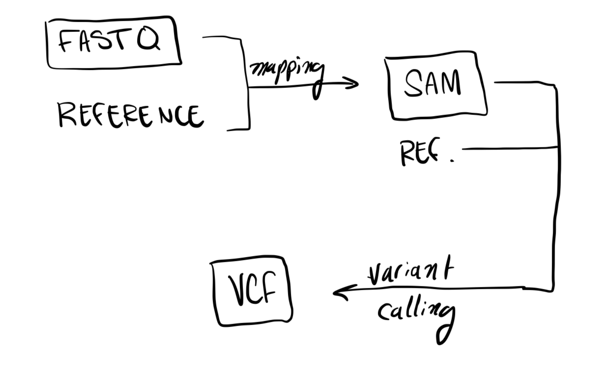
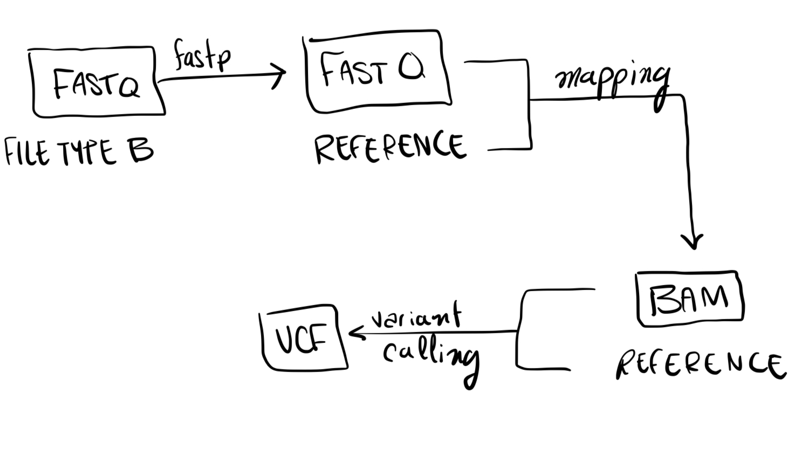

# Genomics Pipeline Introduction Worksheet

<!--- Write name below --->
## Name: 
Syrus Miner
<!--- For this worksheet, answer the following questions --->

## Q1: What is a bioinformatics pipeline?
Answer: A bioinformatics pipeline is a set of tools that allows users to succesfully handle and process
large amount of data. The example we have been seeing is getting lots of DNA fragments and putting them through 
various pipes to find snps.

## Q2: What are the three basic filetypes discussed in this repository? What information do they contain?
Answer: FASTQ - text file that stores raw sequence data with the corresponding quality scores.
BAM - This is a compressed SAM file. This stores alignment information.
VCF - This is a text file that stores the information about the variations or SNPs.

## Q2: What does a general bioinformatics pipeline look like? Draw a schematic of a pipeline (using boxes and arrows) and add the image file name to the <insert-file-name-here> text below (png or jpg will work). Your schematic should include file types, program types (e.g., mapping program), and arrows between file types.

## Q3: Using information from the genomics-pipeline-intro.sh script and [Farkas et al., 2021](https://doi.org/10.3389/fmicb.2021.665041), draw another schematic specific to their study showing file types, program types (use specific program names in this schematic), and arrows between file types. Add the image file name to the <insert-file-name-here> text below.

## Q4: After running the genomics-pipeline-intro.sh script, how many variants are in merged.vcf?
Answer: 8

## Q5: What is the alternate allele depth of sample SRR11621811|unknown at site 25350 in contig NC_045512.2?
Answer: 800

## Q6: In what ways would you consider filtering the VCF? In other words, what criteria would you use to remove variants / genotypes from the dataset?
Answer: Two great ways to filter a VCF are the quality scores and the allele depth of each variant. These two values can help you filter if the variant is valid or not.
